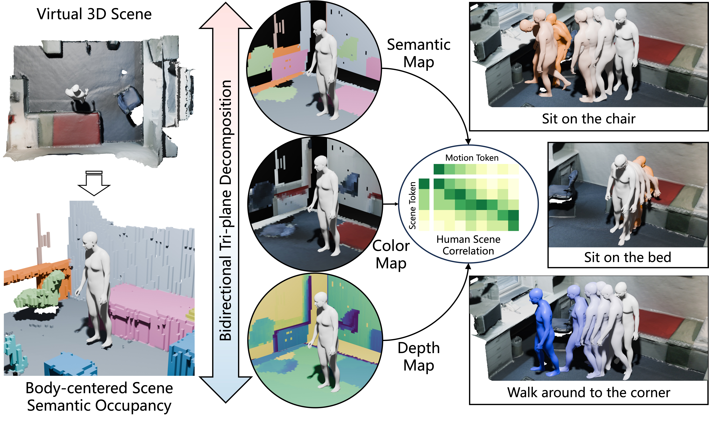

# Human Motion Synthesis in 3D Scenes via Unified Scene Semantic Occupancy
by Jingyu Gong, Kunkun Tong, Zhuoran Chen, Chuanhan Yuan, Mingang Chen, Zhizhong Zhang, Xin Tan\*, Yuan Xie

<p align="center">  </p>

## Introduction
This repository provides the implementation of our AAAI2026 paper *Human Motion Synthesis in 3D Scenes via Unified Scene Semantic Occupancy*.

## Preparation
### Installation
Please follow these instructions to set up your environment.

```
cd SSOMotion
conda env create -f environment.yml
conda activate ssomotion
python -m spacy download en_core_web_sm
pip install git+https://github.com/openai/CLIP.git
```

### Body Models
Please download the [SMPL-X body model](https://smpl-x.is.tue.mpg.de/) and place it in the `./body_models/` folder.

### Dataset
We train our models on [AMASS](https://amass.is.tue.mpg.de) and [HUMANISE](https://silvester.wang/HUMANISE/). We additionally evaluate our method on clutterd scenes from [DIMOS](https://github.com/zkf1997/DIMOS)+[ShapeNet](https://shapenet.org), [PROX](https://prox.is.tue.mpg.de/index.html)+[PROX-S](https://drive.google.com/drive/folders/1nV_S_m0Yl8p3sOaCLpz5IIZxoL4_TAtE?usp=sharing), and [Replica](https://github.com/facebookresearch/Replica-Dataset).
All datasets downloaded from the links should be placed under the project's `dataset/` folder.

For textual annotation, please download the [Babel](https://babel.is.tue.mpg.de/data.html) and [HumanML3D](https://github.com/EricGuo5513/HumanML3D) and place them in the `./dataset/amass/` folder.

## Usage
### Data Preprocessing
Please process the scene and training data separately.
To process the scene data into the semantic occupancy form, run the following script in your terminal:

```
sh shell_scripts/data_process_scripts/process_scene_occ.sh
```

Run this script to preprocess the motion data:

```
sh shell_scripts/data_process_scripts/process_mdm_data.sh
```

### Training
First, train the base diffusion model with the following script:

```sh
bash shell_scripts/train_scripts/train_action2motion.sh
```

Then, use the following script to train the motion controller:

```
sh shell_scripts/train_scripts/train_action2motion_control.sh
```

### Generation
You can run the following command for motion generation in scenes from DIMOS:

```
sh shell_scripts/generate_scripts/generate_for_eval.sh $ACTION
```

where `ACTION` is one of `walk`, `sit`, or `lie`.

We also provide a convenient script for motion generation in scenes from PROX and Replica with the following command:

```
sh shell_scripts/generate_scripts/generate_scene2motion.sh
```

As for motion prediction on HUMANISE dataset, you can run

```
sh shell_scripts/generate_scripts/predict_for_eval.sh
```

### Evaluation
You can evalute the generated motions in scenes from DIMOS using following command:

```
sh shell_scripts/evaluate_scripts/eval_metric.sh $ACTION
```

We also provide the script for motion prediction evaluation on HUMANISE dataset:

```
sh shell_scripts/evaluate_scripts/eval_metric.sh prediction
```

## Acknowledgement
This code is based on [HumanML3D](https://github.com/EricGuo5513/HumanML3D.git), [MDM](https://github.com/GuyTevet/motion-diffusion-model), [OmniControl](https://github.com/neu-vi/OmniControl.git), [HUMANISE](https://github.com/Silverster98/HUMANISE), [SMPL-X](https://github.com/vchoutas/smplx), [COINS](https://github.com/zkf1997/COINS.git), and [DIMOS](https://github.com/zkf1997/DIMOS). If you find them useful, please consider citing them in your work.
